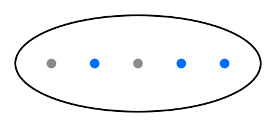

# Surface diagrams

A Python library for generating diagrams of surfaces for work with mapping class
groups and other relevant low dimensional geometry and topology. SVG output allows
for arbitrary enlarging without losing sharpness.

This is extremely experimental for now. It is based on older code a wrote a while ago,
but this is the first local working version, 0.1.0a1. Python 3.9+; no runtime dependencies.
I will finish editing this readme when the software is in a more finished state. For now
what is here may be wrong or not yet implemented.

## Install and make an image

From this directory:

```powershell
python -m pip install -e .
python examples/make_images.py
```

Examples should demonstrate all current capabilities but feel free to make requests.
Three overview sheets, and a [linked gallery](examples/output/GALLERY.md) in `examples/output/`.
All 36 constructors are in [examples/gallery.py](examples/gallery.py).

Run your own scripts with that same Python, or select it in your editor.
For a fresh installation, use recent pip/setuptools: Anaconda pip 21.2 cannot
perform the editable installation above.

```python
from surface_diagrams import PlanarSurface, save_svg

# B = an inner boundary, P = a marked point; order is left to right.
surface = PlanarSurface.row("B P B P P")
save_svg(surface, "my-surface.svg", scale=2)
```



## Adjust the appearance

```python
from surface_diagrams import Style

style = Style(
    boundary_radius=6,
    marked_point_radius=3,
    show_outer_ellipse=False,
)
save_svg(surface, "my-points.svg", style=style)
```

The background is transparent by default. Set `background="#ffffff"` for white.
Colors accept `#RGB` or `#RRGGBB`. Defaults were measured directly from vector
painting commands in the thesis's planar figures (PDF pages 36-38):

| Element | Default | Customization |
| --- | --- | --- |
| Marked points | `#006fff` | `marked_point_color` |
| Inner boundary dots | `#8b8b8b` | `boundary_color` |
| Curves | `#ff00d4` | `curve_color` |
| Surface outline | `#000000` | `outline_color` |

Some other thesis figures use slightly different grays or magentas. These
defaults follow Figures 3.2-3.6 consistently; see [provenance](docs/provenance.md).

## Choose positions and individual sizes

```python
from surface_diagrams import Boundary, MarkedPoint

surface = PlanarSurface(
    objects=[
        Boundary(-70, 0, radius=6),
        Boundary(70, 0, radius=6),
        MarkedPoint(-25, 20),
        MarkedPoint(-25, -20),
        MarkedPoint(25, 20),
        MarkedPoint(25, -20),
    ],
    width=240,
    height=110,
)
save_svg(surface, "custom-surface.svg")
```

Coordinates use drawing units, with the origin at the center, x to the right,
and y upward. Width and height describe the outer ellipse. Dot radii use the
same units. `scale` changes the displayed image size uniformly. Hiding the
outer ellipse preserves the image frame and positions. Automatic rows accept
`spacing`, `height`, and `margin` (distance from an endpoint dot center to the
horizontal tip of the ellipse).

Centers must lie inside the ellipse. At export time each dot's bounding box
must also fit strictly inside it; oversized dots raise a helpful error. This
conservative check can reject some nearly touching dots. Object overlap is
allowed and positions are never moved silently.

`render_svg(surface, ...)` returns text, and `save_svg(surface, path, ...)` writes
it (replacing that exact file if it already exists). A surface also displays
directly in Jupyter with the default style via `_repr_svg_()`.

## Arcs and closed curves

```python
from surface_diagrams import Arc, Loop

surface = PlanarSurface.row("PPPPPP", spacing=55, height=210, margin=60)
save_svg(surface.with_curves(Arc(2, 5, cuts=(3,), start_up=False)), "arc.svg")
save_svg(surface.with_curves(Loop((1, 4))), "loop.svg")
save_svg(surface.with_curves(Loop((0, 6)), Loop((1, 5)), Arc(3, 4)), "nested.svg")
```

The objects must have distinct x coordinates and lie on y=0. Number them 1..n
from left to right, including both boundary dots and marked points. Cut i is
the open horizontal interval between objects i and i+1: the outside intervals
are 0 and n. Arc endpoints 0 and n+1 are the left/right tips of the outer ellipse.
Object endpoints connect to the drawn dot's center, including boundary dots.

`Arc(start, end, cuts=(...), start_up=True)` follows the cuts in the supplied
order, alternating sides after every crossing. Set `start_up=False` to begin
below. Adjacent equal cuts and terminal cuts adjacent to their endpoint are
rejected as nonminimal. Start and end must differ.

`Loop((c0, c1, ...), start_up=True)` starts at the first cut and returns to it
after the final cut. A loop needs an even number of crossings and no cyclic
cancellation. `Loop((i-1, j))` surrounds consecutive objects i..j; e.g.
`Loop((0, 6, 5, 1))` draws a nonconsecutive example around the two end objects.

Use `Style(show_guides=True)` to display the symmetry line, object numbers above
it, and cut numbers below it. `curve_width`, `curve_color`, and `curve_height`
(a fraction in (0,1]) control the curves' appearance. Multiple curves are
routed together and must be disjoint except for shared arc endpoints.

Minimality alone does not imply a simple curve. The renderer searches for a
noninterleaving ordering of repeated visits to each interval, retaining the
same visit position above and below. It draws nested half-ellipses under a
common vertical scaling: this preserves disjoint centerlines and places them
inside the outer ellipse. Joins have matching vertical tangent directions.
An analytic distance check prevents curves from entering unrelated dots.

Unsupported or impossible routes raise `RoutingError`. A failure may mean
insufficient spacing, no noncrossing ordering, or a search limit; the message
distinguishes these. It never silently changes the itinerary. Search is capped
at 20,000 attempted slot assignments, with 64 cuts per curve and 128 route nodes
per diagram. Very dense curves may need thinner strokes, smaller dots, or more
space. This is a drawing convention, not a full isotopy-class classifier or
an implementation of a specifically attributed Thurston coordinate system.

## Higher genus: closed surfaces, then boundary placements

```python
from surface_diagrams import GenusSurface, TypeIBoundary, BoundaryPair

save_svg(GenusSurface(genus=2, show_axis=True), "genus-two.svg")
save_svg(GenusSurface(
    genus=2,
    type_i=(TypeIBoundary(6),),
    type_ii=(BoundaryPair("left"), BoundaryPair("top", position=.65)),
), "genus-two-with-five-boundaries.svg")
```

The contour and lens-shaped handle openings follow the thesis's Figure 2.2
projection. `handle_spacing` and `height` adjust their proportions; optional
`handle_style="balloon"` adds the second handle arc. This extra arc is omitted
on handles occupied by Type I boundaries to keep their rims clear. These are
surface schematics; handle openings are not counted as boundary components.

Type I boundaries occupy fixed slots 1..2g+2 along the horizontal involution
axis. Slot 1 is the left outer tip; each handle contributes its left and right
tip in order; slot 2g+2 is the right outer tip. For genus 2, all six slots are
available. `TypeIBoundary(slot, radius=8)` replaces a contour tip with an oval
boundary rim connected to the upper/lower outlines. Duplicate slots are errors.

Each `BoundaryPair(side, position=.5, radius=7)` produces **two** Type II
boundary components, exchanged by the modeled half-turn. Choose `left`, `right`,
or `top`; `bottom` and `top-bottom` are aliases of `top`, because both members
are always drawn. `position` ranges from 0 to 1 within the selected region.
There is no fixed count limit, but necks must physically fit: enlarge the
surface, separate positions, or reduce radii if they overlap. Neck attachments
are made by splitting the actual contour, so transparent output works without
white masking patches. Type I and Type II radii are geometric boundary sizes,
independent of the planar dot-size settings.

## Scope and next steps

Implemented: planar surfaces, row/custom positioning, adjustable dots/colors,
minimal arcs/loops, noncrossing multicurves, coordinate guides, higher genus,
all fixed boundary slots and left/right/top-bottom paired boundaries, SVG.

Later: standard chain curves on higher-genus surfaces, marked points on them,
Type II boundaries inside handle holes or at front/back locations, asymmetric
layouts, hollow planar boundary circles, TikZ and a LaTeX companion. PNG/PDF
export is not built in; SVGs can be converted externally when needed.

`model.py` holds planar inputs/styles, `curves.py` plans routes, and `genus.py`
builds higher-genus geometry. `layout.py` assembles format-independent primitives;
`svg.py` serializes them. A future TikZ writer can reuse these primitives.

## Development

```powershell
python -m unittest discover -s tests -v
```

Tests use Python's standard `unittest` suite, including coordinate validation,
visit-order preservation, seeded geometric checks, palette and SVG behavior,
boundary symmetry and joins, and gallery smoke tests.
