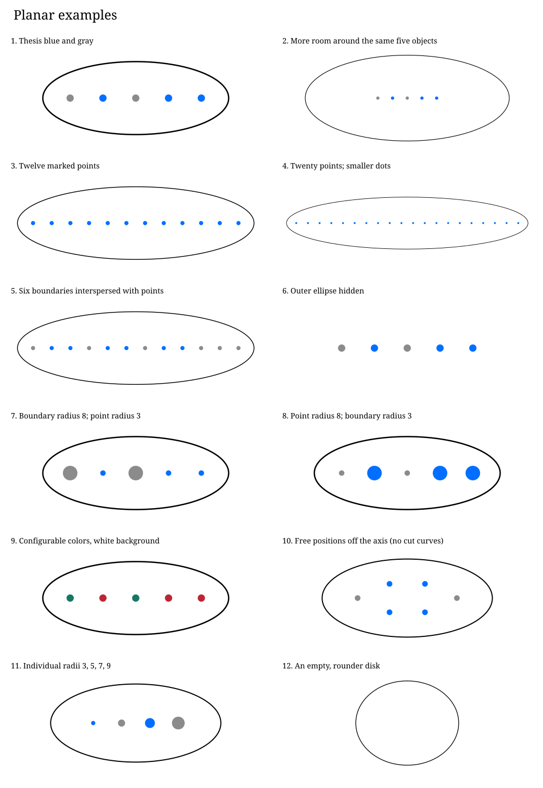
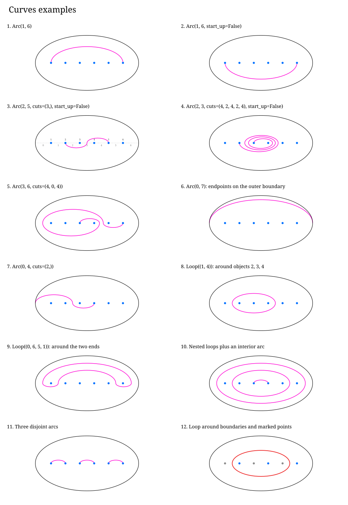
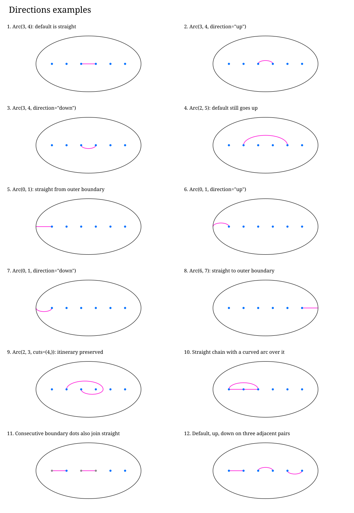
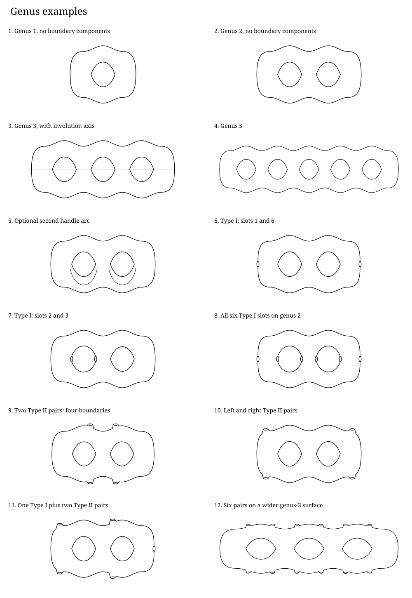

# Surface diagram examples

Run `python examples/make_images.py` to regenerate everything. The constructors are in [gallery.py](../gallery.py).

Blue `#006fff`, gray `#8b8b8b`, and magenta `#ff00d4` are measured from the thesis planar figures. High-genus examples are new schematics following Figure 2.2, with boundary rims distinct from handle openings.

## Planar

- [Thesis blue and gray](planar-default.svg)
- [More room around the same five objects](planar-large-ellipse.svg)
- [Twelve marked points](planar-twelve-points.svg)
- [Twenty points; smaller dots](planar-twenty-points.svg)
- [Six boundaries interspersed with points](planar-mixed-order.svg)
- [Outer ellipse hidden](planar-no-outline.svg)
- [Boundary radius 8; point radius 3](planar-large-boundaries.svg)
- [Point radius 8; boundary radius 3](planar-large-points.svg)
- [Configurable colors, white background](planar-custom-colors.svg)
- [Free positions off the axis (no cut curves)](planar-custom-positions.svg)
- [Individual radii 3, 5, 7, 9](planar-per-object-size.svg)
- [An empty, rounder disk](planar-empty.svg)

## Curves

- [Arc(1, 6)](curves-simple-up.svg)
- [Arc(1, 6, start_up=False)](curves-simple-down.svg)
- [Arc(2, 5, cuts=(3,), start_up=False)](curves-one-cut.svg)
- [Arc(2, 3, cuts=(4, 2, 4, 2, 4), start_up=False)](curves-repeated-cuts.svg)
- [Arc(3, 6, cuts=(4, 0, 4))](curves-winding.svg)
- [Arc(0, 7): endpoints on the outer boundary](curves-outer-endpoints.svg)
- [Arc(0, 4, cuts=(2,))](curves-outer-to-point.svg)
- [Loop((1, 4)): around objects 2, 3, 4](curves-consecutive-loop.svg)
- [Loop((0, 6, 5, 1)): around the two ends](curves-nonconsecutive-loop.svg)
- [Nested loops plus an interior arc](curves-nested.svg)
- [Three disjoint arcs](curves-disjoint.svg)
- [Loop around boundaries and marked points](curves-mixed-loop.svg)

## Directions

- [Arc(3, 4): default is straight](directions-adjacent-default.svg)
- [Arc(3, 4, direction="up")](directions-adjacent-up.svg)
- [Arc(3, 4, direction="down")](directions-adjacent-down.svg)
- [Arc(2, 5): default still goes up](directions-nonadjacent-default.svg)
- [Arc(0, 1): straight from outer boundary](directions-outer-default.svg)
- [Arc(0, 1, direction="up")](directions-outer-up.svg)
- [Arc(0, 1, direction="down")](directions-outer-down.svg)
- [Arc(6, 7): straight to outer boundary](directions-right-default.svg)
- [Arc(2, 3, cuts=(4,)): itinerary preserved](directions-adjacent-with-cuts.svg)
- [Straight chain with a curved arc over it](directions-shared-endpoints.svg)
- [Consecutive boundary dots also join straight](directions-boundary-dots.svg)
- [Default, up, down on three adjacent pairs](directions-three-directions.svg)

## Genus

- [Genus 1, no boundary components](genus-genus-one.svg)
- [Genus 2, no boundary components](genus-genus-two.svg)
- [Genus 3, with involution axis](genus-genus-three.svg)
- [Genus 5](genus-genus-five.svg)
- [Optional second handle arc](genus-balloon.svg)
- [Type I: slots 1 and 6](genus-fixed-ends.svg)
- [Type I: slots 2 and 3](genus-fixed-handle.svg)
- [All six Type I slots on genus 2](genus-all-fixed.svg)
- [Two Type II pairs: four boundaries](genus-paired-top-bottom.svg)
- [Left and right Type II pairs](genus-paired-left-right.svg)
- [One Type I plus two Type II pairs](genus-mixed-types.svg)
- [Six pairs on a wider genus-3 surface](genus-many-pairs.svg)

